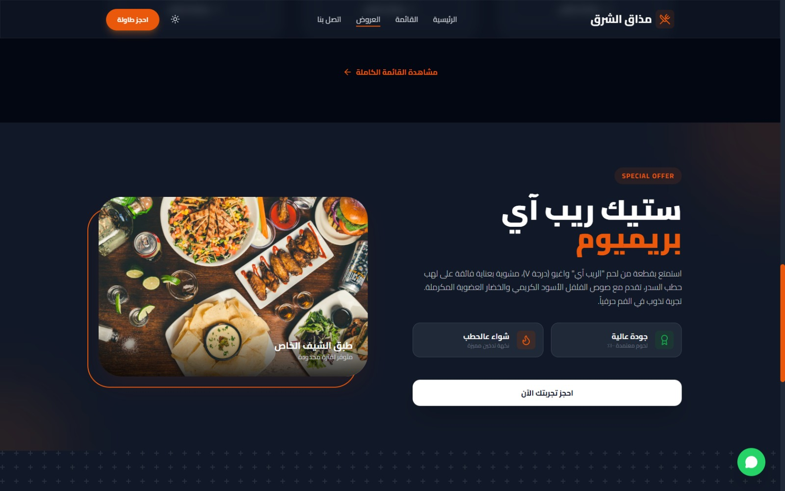
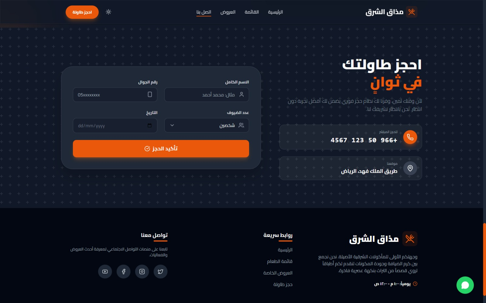

# 🍽️ Mazaq Al-Sharq | Premium Restaurant Website

## Overview
**Mazaq Al-Sharq** is a fully responsive, high-end restaurant website designed to showcase your restaurant's brand, menu, and services. The website focuses on **user experience**, modern design, and smooth interactions, making it perfect for presenting a professional dining experience online.

---

## 🌟 Key Features
- **Responsive Design**: Works flawlessly on desktop, tablet, and mobile devices.  
- **Modern UI/UX**: Clean layouts, elegant typography, and smooth animations.  
- **Interactive Elements**: Buttons, hover effects, and dynamic interactions for enhanced user engagement.  
- **Menu Display**: Showcases dishes with images, descriptions, and pricing in a visually appealing way.  
- **Reservation Form**: Enables users to make table bookings directly from the site.  
- **High Customizability**: Easily replace images, text, and colors to match your brand.  
- **Dark Mode Support**: Optional dark theme for a premium look.  
- **Lightweight & Fast**: Optimized code using HTML, Tailwind CSS, and JavaScript.  
- **Cross-Browser Compatible**: Works on all modern browsers.  

---

## 🛠️ Technologies Used
- **HTML5**
- **Tailwind CSS**
- **JavaScript**
- **Lucide Icons**
- Responsive design principles

---

## 📷 Screenshots
  
  
  

---

## 📂 Folder Structure
